업무에 바로 쓰는 엑셀(기본)
=========================

# Ⅰ. 기본 구성과 데이터 다루기

## 1. 화면 구성
### 가. 스프레드시트
엑셀은 스프레드시트 프로그램입니다. 표 형식으로 데이터를 입력, 계산, 저장, 분석, 관리합니다. 경리, 회계 등 계산을 하는 작업에 사용되도록 개발되었습니다.

최초의 스프레드시트 프로그램은 애플에서 동작하는 비지컬크(VisiCalc)이고, DOS 환경에서는 로터스 1-2-3 프로그램이 대표적입니다. 엑셀은 1985년 매킨토시용으로 발표되고, 1987년 윈도용 버전이 발표되어 현재 스프레드시트 프로그램의 대명사가 되었습니다.

현재 사용되고 있는 스프레드시트 프로그램은 엑셀 이외에도 한글과컴퓨터사의 한컴오피스에 포함되어 있는 한셀, 오픈오피스에 포함되어 있는 컬크(Calc), 애플 넘버스(Numbers), 구글 스프레드시트 등이 있습니다.

요즘 사용되는 스프레드시트 프로그램에는 본래 기능인 계산 기능 이외에도 워드프로세서 프로그램과 같은 문서 작성 기능, 데이터베이스 프로그램과 같은 데이터관리 기능, 데이터를 시각적으로 표현하는 그래프 기능 등이 추가되어 사무용 통합 작업 프로그램 성격이 강합니다.

스프레드시트 프로그램의 작업 형식과 환경은 처음 발표될 때부터 구성되어 있는 형식과 환경이고, 새로운 추가 기능과 함수는 지금도 추가되고 있습니다.

엑셀은 1993년 반복 작업이나 복잡한 작업을 자동화할 수 있는 매크로 기능을 구현하는 VBA(Visual Basic for Application)를 포함하게 되어 사용자가 직접 필요한 기능을 추가할 수 있는 방법도 제공하고 있습니다.

현재 최신버전은 엑셀 2019 버전이고 연간사용료를 지불하는 방식으로 최신 기능을 제공하는 마이크로소프트 365 버전도 같이 발표하고 있습니다.

### 나. 화면 구성
표 형식의 작업 공간은 시트(Sheet)이고, 시트를 구성하는 각 칸은 셀(Cell)입니다. 시트가 모여 하나의 파일이 되기 때문에 엑셀 파일은 통합문서라고 부릅니다.

가로 방향은 행(Row), 세로 방향은 열(Column)로 부르고, 행과 열로 셀 주소를 구분해 나타내는데, 행은 1부터 시작되는 숫자, 열은 A부터 시작하는 문자로 나타냅니다.

행 숫자는 1부터 1,048,576까지이고, 열은 A부터 XFD까지 16,384개입니다. 한 파일의 최대 시트 수는 255개까지입니다. 1행 A열에 있는 셀 주소는 [A1] 셀입니다.

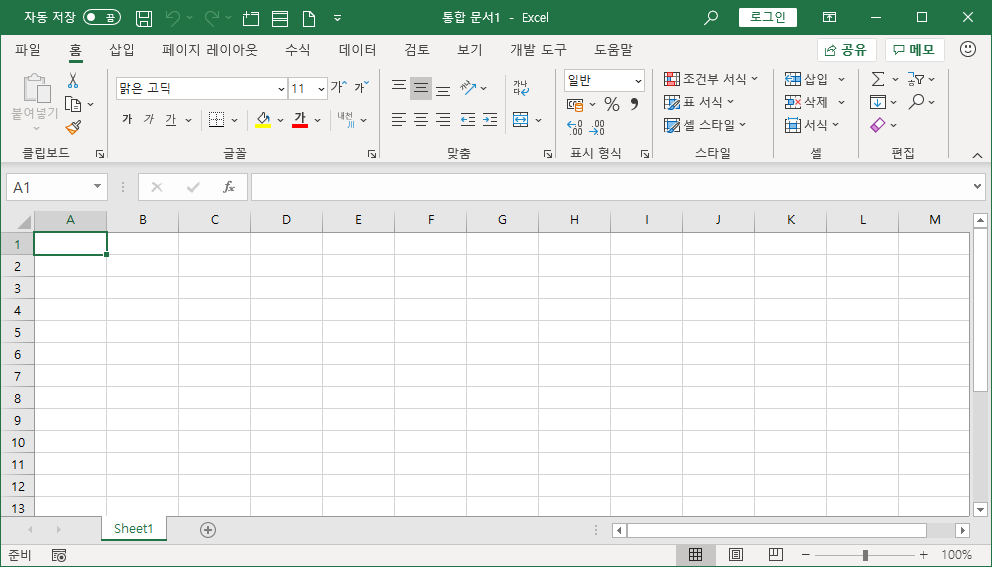

리본 메뉴가 자리를 차지하고 있어 작업 공간이 부족한 경우 축소하거나 원래 상태로 두도록 선택할 수 있습니다. 방법은 리본 메뉴 이름을 더블클릭하거나 단축키 &lt;Ctrl + F1&gt;을 눌러 바꿉니다.

수식 입력줄은 선택한 셀에 데이터를 입력하는 역할과 셀에 입력된 내용을 확인하는 역할을 합니다. 셀에 입력된 내용은 데이터 표시형식 기능으로 입력된 내용과 다른 모습으로 꾸밀 수 있는데, 수식 입력줄에는 본래 내용이 표시됩니다. 수식의 경우에 셀에는 수식의 결과가 표시되고 수식 입력줄에는 입력한 수식 자체가 표시됩니다.

셀에 입력된 내용이 많아 수식 입력줄에 모두 표시되지 않는다면 수식 입력줄을 확장해 나타낼 수 있습니다. 기본값은 세 줄로 표시되는데, 수식 입력줄 아래와 열 머리글 사이에 커서를 두고 드래그 하면 크기를 늘리거나 줄일 수 있습니다. 수식 입력줄을 확장하거나 축소하는 단축키는 &lt;Ctrl + Shift + U&gt;입니다.

수식 입력줄 앞에는 이름 상자가 있습니다. 현재 선택된 셀 주소를 나타내는 역할을 하고, 셀 주소를 적어 원하는 셀로 빠르게 이동하거나 셀이나 셀 범위를 원하는 이름으로 지정하는 역할도 합니다.

화면 제일 위쪽에 있는 제목 표시줄 왼쪽에 빠른 실행 도구 모음이 표시됩니다. 자주 사용하는 기능을 등록해 두고 빠르게 사용할 수 있습니다. 빠른 실행 도구 모음 오른쪽에 빠른 실행 도구 모음 사용자 지정에서 새 항목을 등록하거나 제거할 수 있습니다.

엑셀에도 여러 가지 단축키를 제공합니다. 자주 사용되는 기능은 단축키를 외워서 사용하는 것이 작업 시간을 줄이는 방법입니다. 리본에서 항목에 커서를 두고 조금 기다리면 선택한 항목의 이름이 나타나고, 단축키가 있는 경우에는 단축키도 같이 보여 줍니다.

그리고 &lt;Alt&gt;를 누르면 선택할 수 있는 항목에 단축키를 표시합니다. 표시된 단축키를 선택하면 하위 항목 내용의 단축키도 차례대로 표시됩니다. 한 번에 실행되는 단축키가 없는 경우 유용하게 사용할 수 있습니다.

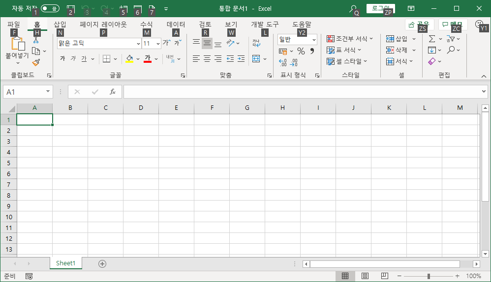

예를들어 열 너비를 입력된 내용에 자동으로 맞추려면 &lt;Alt + H, O, I&gt;를 입력하면 실행됩니다.

화면 제일 아래 상태 표시줄에는 현재 상태를 나타냅니다. 선택된 셀 범위에 입력된 내용에 따라 합계나 평균과 같은 계산값을 나타내기도 하고 통합 문서 보기 상태나 화면 확대/축소 기능도 나타냅니다. 상태 표시줄에서 마우스 오른쪽 클릭하면 나타낼 항목을 사용자가 지정할 수 있습니다.

[보기]-[표시] 그룹에서 수식 입력줄, 눈금선, 머리글 표시 여부를 선택할 수 있습니다.

## 2. 데이터 입력
### 가. 입력 방법
데이터를 입력할 때 첫 번째 해야 할 일은 어떤 셀에 입력을 할 것인가를 정하는 것입니다. 엑셀은 시트로 구성되어 있고, 시트는 셀로 구성되어 있습니다. 셀이 아닌 다른 곳에는 입력할 수 없고, 여러 셀에 걸치는 내용을 적을 때는 첫 번째 셀에 입력해야 합니다.

선택한 셀에 내용을 입력하면 셀은 편집 모드가 되고 내용을 모두 입력하면 &lt;Enter&gt;를 눌러 기본 상태로 전환합니다. &lt;Enter&gt;를 눌러 기본 상태로 전환하는 것까지 해야 입력 작업이 완료되는 것입니다.

&lt;Enter&gt;는 입력을 완료하고 아래 셀로 커서를 옮깁니다. 현재 셀에서 입력을 마무리 하고 싶다면 &lt;Ctrl + Enter&gt;를 누르고, 입력을 마무리하고 위쪽 셀로 이동하려면 &lt;Shift + Enter&gt;를 누릅니다. 입력을 마무리하고 오른쪽 셀로 이동하려면 &lt;Tab&gt;를 누르고, 왼쪽 셀로 이동하려면 &lt;Shift + Tab&gt;를 누릅니다.

&lt;Enter&gt;나 &lt;Tab&gt;을 누르지 않고 화살표를 눌러 이동할 수도 있지만 &lt;Enter&gt;나 &lt;Tab&gt;을 눌러 입력을 마무리하고 이동하는 방법을 사용하도록 추천합니다. &lt;Enter&gt;를 누를 땐 자판 입력 상태에서 손을 떼지 않고 누를 수 있습니다. 화살표는 손을 들어 옆으로 옮겨서 눌러야 합니다. &lt;Tab&gt;을 이용해야 하는 이유는 오른쪽 방향으로 차례대로 입력한 다음 &lt;Enter&gt;를 누르면 입력을 시작한 첫 번째 셀 아래에 커서가 놓이게 됩니다. 화살표로 옮겼다면 마지막 입력 셀 아래쪽 셀에 커서가 놓이게 됩니다.

입력된 내용을 수정하려면 마우스 커서로 수정할 부분을 더블클릭하거나 수정할 셀을 선택하고 &lt;F2&gt;를 누르면 수정 상태로 전환됩니다.

셀 안에서 줄바꿈을 하려면 워드프로세서 프로그램에서와 달리  &lt;Enter&gt;만 눌러서는 안되고 &lt;Alt + Enter&gt;를 눌러야 합니다.

행 방향으로 관련된 내용을 입력할 수도 있지만 보통은 열 방향으로 같은 데이터 형식의 내용을 입력하는 것이 편리합니다.

열 방향으로 입력할 때는 자동완성 기능이 동작합니다. 입력할 내용이 위쪽 셀에서 입력한 내용과 같으면 첫 한, 두 글자를 입력하면 위쪽에서 입력한 내용 전체가 표시됩니다. 나머지를 입력하지 않고 &lt;Enter&gt;만 누르면 입력이 완료됩니다. 만약 앞 부분만 위쪽에서 입력한 내용과 같고 뒤 내용은 다른 내용이라면 자동 완성된 내용은 무시하고 계속 입력한 뒤 &lt;Enter&gt;를 누르면 됩니다.

위쪽 셀에 여러 내용이 입력된 아래쪽 셀에서 &lt;Alt + 아래쪽화살표&gt;를 누르면 입력된 내용 중 중복된 부분은 반복해서 나타내지 않고, 선택해서 입력할 수 있는 목록을 표시하는 기능도 제공됩니다.

### 나. 데이터 형식
엑셀은 입력 데이터 형식을 엄격히 따집니다. 문자, 숫자, 날짜/시간 형식이 있습니다. 숫자나 날짜/시간 형식이 아닌 모든 것은 문자 형식입니다.

숫자 형식으로 입력하는 것은 숫자만 입력하는 것입니다. 부호를 추가하거나 소수점을 입력하는 것은 허용됩니다. 그 외의 다른 문자와 같이 입력하면 숫자가 아닌 다른 형식이 될 수 있습니다.

계산할 필요가 있는 데이터를 입력할 때 숫자 형식으로 입력합니다. 몇가지 예외가 있는데, 주민등록번호, 전화번호, 우편번호와 같이 계산에서 사용하지는 않지만 숫자로만 이루어져 입력할 때 숫자만 입력하면 편리한 항목들입니다. 이 경우 전화번호처럼 앞자리에 0을 입력하면 숫자로서는 유효하지 않기 때문에 0을 표시하지 않습니다. 그래서 데이터 표시 형식 기능으로 나타내는 작업을 해야 합니다.

숫자를 입력할 때 11자리까지는 입력한 모양 그대로 표시되지만 12자리부터는 지수 형식으로 표시됩니다. 그리고 최대 입력할 수 있는 숫자는 15자리까지입니다. 16자리부터 입력되는 숫자는 어떤 숫자를 입력하던 0으로 표시됩니다. 프로그램 효율을 위해 최대 입력 자리를 제한하는 것입니다.

백분율은 입력할 때 숫자 끝에 퍼센트(%) 기호를 붙여 바로 나타낼 수 있습니다. 숫자를 입력할 때 천단위 구분기호로 쉼표(,)를 함께 입력할 수도 있습니다.

분수 1/2를 입력하려면 앞에 0을 먼저 적고 한 칸 띄우고 1/2를 입력해야 합니다. 즉 0 1/2로 입력해야 합니다. 1과 1/2라면 1 1/2로 입력합니다. 분수로 입력된 값은 수식 입력줄에는 소수로 표시됩니다.

날짜/시간 형식에서 날짜는 하이픈(-)이나 슬래시(/)로 구분해서 적어야 합니다. 1-2라고 입력하면 ‘01월 02일’로 셀에 표시되고 수식 입력줄에는 2021-01-02로 표시됩니다. 연도를 적지 않으면 올해연도가 추가되어 나타납니다. 날짜를 입력할 때 슬래시보다는 하이픈으로 입력하는 경우가 많은데, 기본값 형식이 하이픈으로 구분하는 형식이기 때문입니다.

시간은 콜론(:)으로 구분해 입력합니다. 12:00을 입력하면 낮 12시를 나타내고 수식 입력줄에는 12:00:00 PM으로 표시됩니다.

한글로 적어서 날짜나 시간 형식으로 입력될 수도 있습니다. 2021년 1월 1일로 입력하면 수식 입력줄에 2021-01-01로 나타나 날짜로 입력된 것을 확인할 수 있고, 12시 0분으로 입력하면 12시 00분으로 표시되고 수식 입력줄에는 12:00:00 PM으로 표시되어 시간 형식으로 입력된 것을 확인할 수 있습니다.

날짜는 1900년 1월 1일부터 9999년 12월 31일까지 표현할 수 있고, 시간은 최대 9999:59:59까지 표현할 수 있습니다.

날짜와 시간은 엑셀 내부적으로 다룰 땐 숫자에 해당하기 때문에 계산이 가능합니다. 하루는 숫자 1이고, 시간은 1을 나눈 값으로 표현합니다. 가령 6시간은 0.25가 됩니다.

숫자만 입력한 경우에 문자 형식으로 나타내려면 작은따옴표(‘)를 먼저 입력하고 뒤에 숫자를 적으면 문자 형식이 됩니다. 수식의 경우에도 이퀄(=) 앞에 작은따옴표를 먼저 적고 입력하면 수식이 아닌 문자가 되어 계산되지 않고 글자 그대로 표시됩니다.

엑셀 기능을 제대로 쓰려면 데이터 입력 형식부터 정확하게 맞춰 입력해야 합니다.

## 3. 데이터 표시 형식
입력된 데이터를 표현하고 싶은 모양으로 나타내기 위해 사용되는 기능이 데이터 표시 형식입니다.

엑셀에 데이터를 입력할 때 엄격한 데이터 형식을 확인하기 때문에 원하는 모양대로 입력할 수 없습니다. 예를들어 12자리 이상의 숫자를 입력하면 지수 형식으로 표시되는데 입력한 숫자 모양 그대로 나타나게 하려면 데이터 표시 형식에 숫자 형식을 선택하면 됩니다.

[홈]-[표시 형식]에서 표현하고 싶은 형식을 찾아 나타낼 수 있습니다. 상세한 표시 형식은 [표시 형식] 그룹명 옆 [대화 상자] 아이콘을 선택하거나 단축키 &lt;Ctrl + 1&gt;을 눌러 [셀 서식] 대화상자를 실행하고 [표시 형식] 탭 [범주] 목록에서 먼저 선택하고 세부 내역을 차례로 선택해 나타냅니다.

일반 형식은 사용자가 입력한 내용을 그대로 나타내는 표시 형식인데 기본적으로 숫자를 나타내는 형식입니다.

숫자, 통화, 회계, 백분율, 분수, 지수 형식은 숫자 형식을 표현하는 형식들입니다. 기타 형식도 우편 번호, 전화 번호, 주민등록번호처럼 계산에는 사용하지 않지만 숫자 형식으로 입력된 데이터를 형식에 맞춰 나타낼 때 사용됩니다.

날짜, 시간 형식은 각각 이름처럼 날짜 형식, 시간 형식을 표시하는 다양한 형식들이 있습니다.

텍스트는 입력된 내용 그대로 나타내는 것이라 범주에 형식은 있지만 따로 선택할 수 있는 것이 없습니다.

마지막에 있는 사용자 지정은 정해진 형식이 아니라 사용자가 원하는 특정한 형식을 직접 지정하는 항목입니다. 범주 중 일반을 선택한 다음 바로 사용자 지정을 선택하면 ‘G/표준’으로 표시됩니다. 일반 형식을 나타내는 약속된 표현입니다. 같은 방법으로 범주에서 통화를 선택한 다음 바로 사용자 지정을 선택하면 ‘￦#,##0’ 형식으로 되어 있는 것을 볼 수 있습니다. ￦는 원화 기호를 앞에 표시하라는 의미이고, #,##0은 입력된 숫자를 천단위 구분기호와 함께 나타내라는 의미입니다. 셀에 12345를 숫자 형식으로 입력하고 사용자 지정 표시 형식은 ‘#,##0개’라고 입력되어 있다면 ‘12,345개’로 표시됩니다.

날짜 형식에는 y, m, d 기호를 쓰고, 시간 형식에는 h, m, s, AM/PM 기호를 씁니다.

문자 형식은 @ 기호만 있는데 사용자가 입력한 내용을 의미합니다. 셀에 ‘홍길동’이 입력되어 있고 사용자 지정 표시 형식에 ‘@ 귀하’라고 입력되어 있다면 셀에 표시되는 것은 ‘홍길동 귀하’가 됩니다.

사용자 지정 표시 형식에 더 많은 약속된 기호와 표현 방법이 있지만 처음부터 모두 배우고 사용하려면 효율적이지 않습니다. 필요할 때 사용 방법을 검색해도 충분합니다.

## 4. 채우기
채우기 기능은 기본적으로 데이터 복사/붙여넣기 기능입니다. 채우기를 이용하면 빠르게 입력할 수 있고 반복되는 작업을 줄일 수 있습니다.

셀을 선택하면 오른쪽 아래쪽 셀 테두리에 채우기 핸들이 표시됩니다. 채우기 핸들에 마우스 커서를 두고 원하는 방향으로 드래그한 뒤 드롭하면 채우기 기능이 동작합니다.

채우는 데이터 형식에 따라 문자 채우기, 숫자 채우기, 날짜 채우기, 수식 채우기가 있고, 채우는 방식에 따라 셀 복사, 연속 데이터 채우기, 서식만 채우기, 서식 없이 채우기, 빠른 채우기가 있습니다.

&lt;Ctrl&gt;을 누르거나 누르지 않는 상태로 채우기를 했을 때 셀 복사와 연속 데이터 채우기 기능이 선택되거나 해제됩니다.

문자 형식을 대상으로 사용자가 미리 지정해 둔 목록을 채우는 기능인 사용자 지정 채우기를 사용할 수 있습니다. 요일을 순서대로 채우거나 1월부터 12월까지 채우는 경우 사용할 수 있습니다. 사용자 정의로 채울 수 있는 목록을 확인하거나 새로운 목록을 추가, 기존 목록 수정, 삭제하려면 [파일]-[옵션]-[고급]에서 [사용자 지정 목록 편집] 항목을 선택합니다. 기본으로 등록된 사용자 지정 목록은 수정, 삭제할 수 없습니다.

빠른 채우기는 엑셀 2013 버전 이상에서 사용할 수 있는 새로운 기능입니다. 패턴을 감지해 자동으로 데이터를 입력하는 기능으로, 사용자가 직접 힘들게 해야 했던 작업을 간단하게 처리하는 기능으로 오랫동안 엑셀을 사용했던 사람들도 일부러 찾아보지 않았다면 모르는 경우가 많은 유용한 기능입니다.

채우기를 하면 채우기된 마지막 셀 위치에 채우기 옵션 단추가 표시됩니다. 채우기 옵션 항목 중 빠른 채우기를 선택하면 동작합니다.

엑셀 스스로 패턴을 감지해서 동작하는 기능이기 때문에 패턴을 확인할 수 없다면 아무런 동작도 하지 않고 데이터 구조가 일정하지 않으면 원하는 형태로 동작하지 않기도 합니다.

채우기해야 할 셀이 많은 경우 끝까지 드래그 하지 않더라도 채우기 핸들에 마우스 커서를 두고 더블 클릭하면 행 방향 범위 끝까지 자동으로 채우기가 진행됩니다.

# Ⅱ. 문서 만들기와 인쇄
## 1. 간단한 계산표 만들기

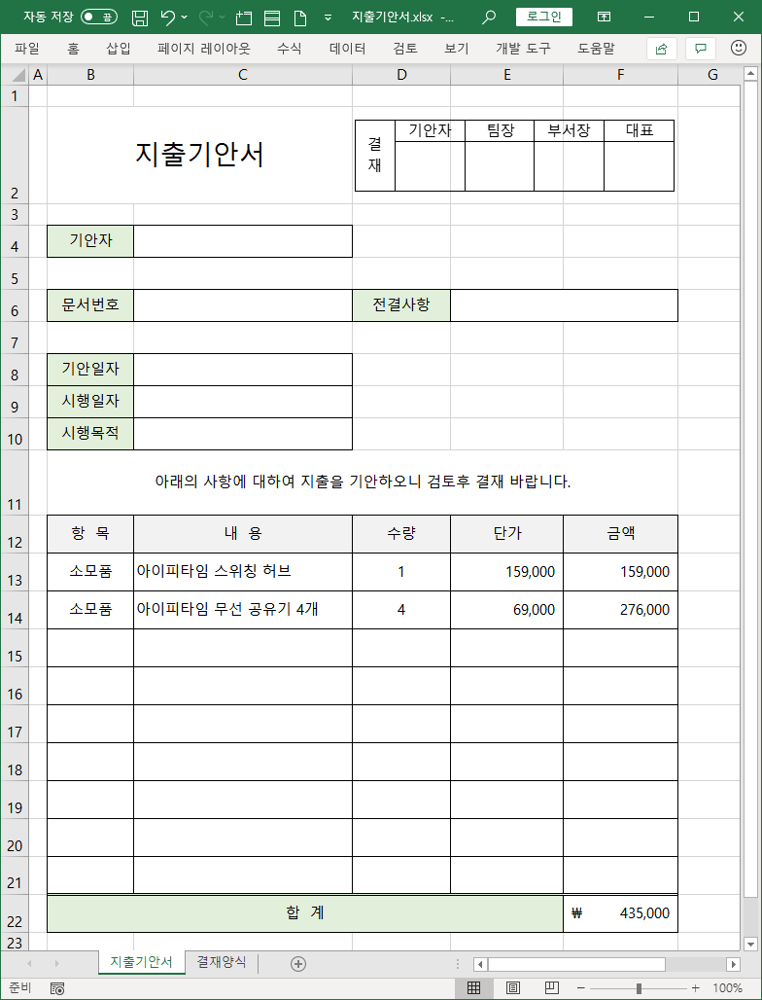

문서 작성 작업을 할 때는 데이터 입력 작업과 서식 작업을 분리해서 데이터 입력을 먼저 하고 서식 작업을 나중에 하는 것이 작업 시간을 줄이는 방법입니다. 데이터 입력은 셀 위치를 정하는 것이 중요합니다. 여러 셀을 묶어 입력할 때는 묶을 범위 첫 번째 셀에 내용을 입력합니다.

[홈] 리본의 [글꼴], [맞춤], [표시 형식], [셀] 그룹 기능을 사용하고 금액과 합계를 구하기 위해 수식 기능도 이용해 작성합니다.

특히 행과 열 위치에 상관없이 작성된 결재란은 [선택하여 붙여넣기] 기능 중 그림으로 붙여넣기, 연결된 그림으로 붙여넣기 기능을 사용해서 작성합니다.

## 2. 인쇄
시트는 워드프로세서 프로그램의 작업 환경과 달리 인쇄 용지와 일대일로 대응되지 않습니다. 그래서 인쇄할 때 시트에 입력되어 있는 내용을 인쇄 용지에 어떻게 맞춰 출력할 것인지 정하는 작업이 중요합니다.

### 가. 인쇄 용지와 맞추기
[페이지 레이아웃]-[페이지 설정]에서 용지 크기를 먼저 정하고, 입력된 내용이 가로로 나열되는지, 세로로 나열되는지에 따라 용지 방향을 세로로 나타낼 것인지, 가로로 나타낼 것인지 정합니다. 용지 여백 항목에서 여백을 조정합니다.

용지 크기에 비해 출력할 내용이 적다면 문제가 되지 않지만 출력할 내용이 많다면 [크기 조정]에서 너비, 높이 항목을 이용해 확대/축소 배율을 조절합니다. 배율을 축소해서 인쇄 용지에 맞추는 것은 자동으로 지정할 수 있지만 확대하는 것은 직접 배율 값을 입력해야 합니다.

### 나. 인쇄하기
[파일]-[인쇄]를 선택하면 인쇄 설정 메뉴와 인쇄 미리 보기가 표시됩니다. 인쇄 단위는 현재 선택된 활성 시트 단위인데, 전체 통합 문서로 선택해 여러 시트 내용을 일괄 인쇄할 수도 있습니다.

설정 항목 마지막에서 ‘현재 설정된 용지’, ‘한 페이지에 시트 맞추기’, ‘한 페이지에 모든 열 맞추기’, ‘한 페이지에 모든 행 맞추기’로 인쇄 용지에 맞춰 자동으로 크기 비율을 지정합니다.

### 다. 페이지 나누기 미리 보기
[보기]-[통합 문서 보기]-[페이지 나누기 미리 보기]는 시트를 인쇄 용지에 맞춰 인쇄되는 범위를 표시합니다.

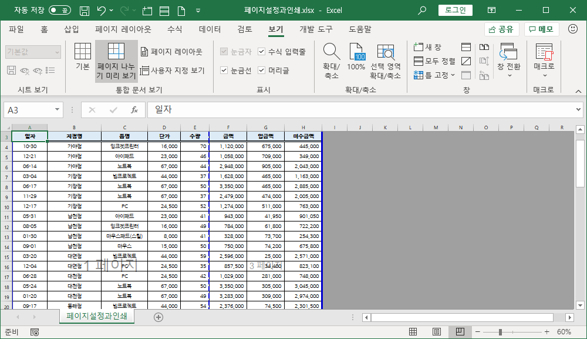

페이지가 나누어지는 부분을 파란색 점선으로 표시합니다. 용지 크기에 맞게 내용이 채워지면 다음 페이지로 넘어가는 곳에 파란색 점선으로 나누어진 부분을 표시하는데, 직접 원하는 위치에서 페이지를 나누려면 [페이지 레이아웃]-[나누기]-[페이지 나누기 삽입]을 선택합니다. 원래 기본 페이지 나누기 상태로 전환하려면 [페이지 나누기 모두 원래대로]를 선택합니다.

### 라. 인쇄 제목
여러 페이지에 출력되는 경우 첫 페이지에 있는 제목은 다른 페이지에는 표시되지 않습니다. 다른 페이지에도 제목이 출력되도록 설정하려면 [페이지 레이아웃]-[페이지 설정]-[인쇄 제목]을 선택합니다. 행 방향으로 나열되는 페이지라면 [반복할 행] 항목에, 열 방향으로 나열되는 페이지라면 [반복할 열] 항목에 커서를 두고 제목이 있는 셀 범위를 선택합니다.

# Ⅲ. 데이터 기능과 조건부 서식
## 1. 정렬, 필터
### 가. 정렬
력된 데이터를 순서대로 나열하는 정렬 기능은 데이터 관리 기능의 기본 기능입니다. 데이터를 입력할 때는 정렬을 염두에 둘 필요없이 입력하고 입력이 완료된 뒤 정렬합니다. 특별히 일정한 기준으로 정렬하길 원한다면 정렬의 기준이 되는 필드를 만들어 원하는 순서로 값을 입력해 둘 수 있습니다.

정렬 기준은 셀 값을 기준으로 오름차순, 내림차순이 기본이고, 셀 색, 글꼴 색, 조건부 서식 아이콘을 기준으로 정렬할 수도 있습니다.

간단한 오름차순, 내림차순 정렬은 정렬하려는 필드의 필드명이나 필드 값이 입력된 셀에 커서를 두고 [데이터]-[오름차순], [데이터]-[내림차순] 항목을 선택하면 동작합니다.

주의할 점은 정렬할 대상을 범위 선택하는 경우입니다. 따로 범위 선택하지 않는 경우 자동으로 데이터베이스 범위를 감지해 범위 선택을 합니다. 직접 범위를 선택할 때 데이터베이스 중 일부만 범위를 선택해 정렬하면 관련된 데이터 구조가 깨어집니다. 판매 내역 데이터베이스에서 지점명만 범위 선택해 오름차순 정렬을 하면 정렬 경고 창이 나타납니다.

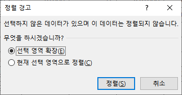

[선택 영역 확장]을 선택하면 데이터베이스 범위를 자동으로 선택하게 되어 범위 선택을 하지 않고 정렬을 실행한 것과 같은 결과입니다.

[현재 선택 영역으로 정렬]을 하면 나머지 항목은 원래 위치에 있는데, 지점명만 오름차순 정렬이 되므로 행 방향으로 관련된 내용이 어긋나게 되는 겁니다.

여러 가지 필드로 정렬을 하는 경우, 예를들어 지점명으로 정렬을 하고 같은 지점은 품명으로 정렬하고, 품명까지 같은 경우엔 일자를 기준으로 정렬하는 경우에는 [데이터]-[정렬 및 필터]-[정렬]을 선택해 순서대로 정렬 기준을 추가해 실행합니다.

오름차순이나 내림차순이 아닌 사용자가 원하는 순서로 정렬을 하려는 경우엔 [정렬] 대화상자에서 [정렬] 중 [사용자 지정 목록]을 선택해 정렬 순서를 직접 목록으로 지정합니다. 사용자 지정 목록은 사용자 지정 채우기에서도 사용됩니다.

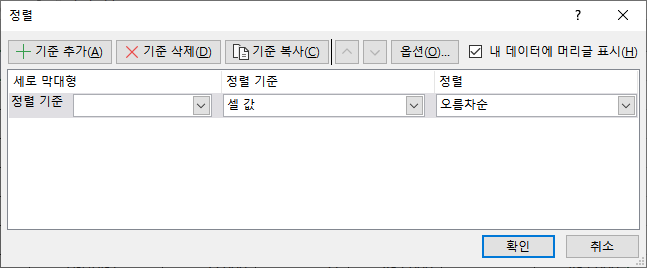

### 나. 필터
원하는 데이터만 화면에 표시되도록 동작하는 기능이 필터입니다. 제외된 데이터는 화면에 표시되지 않도록 숨겨집니다. 필터 기능을 해제하거나 필터 조건을 해제하면 숨겨진 데이터는 원래 위치에 나타납니다.

[데이터]-[정렬 및 필터]-[필터]를 선택하거나 단축키 &lt;Ctrl + Shift + L&gt;을 입력하면 필터가 적용되어 필드명 옆에 역삼각형이 나타납니다. 역삼각형을 누르면 필터 목록이 나타납니다. 필드에 입력된 데이터 형식에 따라 나타나는 목록 내용이 달라집니다.

첫 번째 항목으로는 정렬이 있고, 그 아래로 텍스트 필터, 숫자 필터, 날짜 필터가 표시됩니다. 필드에 채우기 색이 설정된 셀이 있는 경우 색 기준 필터 항목도 활성화 됩니다. 마지막에 체크 표시가 있는 목록에서 필터할 항목을 직접 선택할 수도 있습니다.

필터가 적용되면 필드명 옆 역삼각형에 필터 모양의 아이콘이 표시되어 필터 조건이 입력된 필드라는 것을 알려줍니다. 여러 필드에 필터 조건을 설정하면 모든 조건에 맞는 항목만 필터해 보여 줍니다. 여러 필드에 설정된 조건 중 어느 조건에든 맞는 항목을 필터해 모두 보여 주는 기능은 필터로는 되지 않고 [고급 필터] 기능을 써야 합니다.

여러 필드에 적용된 필터 조건을 해제하려면 각 필드명 역삼각형을 눌러 하나씩 해제할 수도 있고, [데이터]-[정렬 및 필터]-[지우기] 항목을 선택해 한꺼번에 해제할 수도 있습니다. 필터된 상태에서 내용을 수정한 후 현재 적용되어 있는 필터를 다시 적용하려면 [다시 적용] 항목을 선택합니다.

필터된 결과를 다른 곳에 복사하려면 보통 복사하듯이 범위를 선택해 복사/붙여넣기 하면 됩니다. 현재 화면에 표시되는 필터된 결과만 복사됩니다. 데이터베이스 범위를 선택할 때 단축키 &lt;Ctrl + Num *&gt; 또는 &lt;Ctrl + Shift + *&gt;를 누르면 한 번에 선택이 됩니다. 더 이상 필터 기능을 사용하지 않으려면 [데이터]-[정렬 및 필터]-[필터]를 다시 누르면 필터 기능이 해제되고 필드명 옆 역삼각형 표시가 사라집니다.

## 2. 표 서식
표 기능은 엑셀 2007 버전 이상에서 사용하는 새로운 데이터 관리 기능입니다. 표로 전환할 데이터 범위 셀에 커서를 두고 [홈]-[스타일]-[표 서식]을 선택하거나 [삽입]-[표]-[표], 또는 단축키 &lt;Ctrl + T&gt;를 눌러 전환합니다. [표 만들기] 대화상자가 표시되고, 표로 전환할 셀 범위를 선택합니다.

표로 전환이 되면 데이터를 다루는 방식이 기존 방식과 완전히 달라집니다. 표는 데이터를 하나의 개체로 다룹니다. 표 범위에 커서를 놓고 있으면 [표 디자인] 리본이 추가로 나타나며 표와 관련된 여러 가지 기능을 제공합니다.

[표 이름]은 선택된 표 개체를 나타내는 이름이고 셀 범위를 쓰듯이 이름을 쓸 수 있습니다. 표에 포함되어 있는 특정 필드를 이름으로 지정할 때는 ‘표1[지점명]’으로 쓰면 됩니다. 표 안에서 수식을 작성할 때 쓰는 방법입니다.

표에서 마우스 휠을 돌려 아래로 내리면 열 머리글에 필드 이름이 표시됩니다. 각 열이 어떤 필드인지 쉽게 확인할 수 있는 기능입니다.

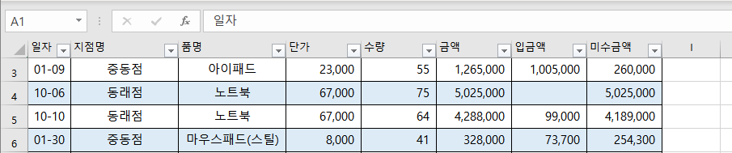

[표 디자인]-[표 스타일]에서 셀 채우기 색, 테두리 모양을 선택해 한 번에 바꿀 수 있습니다. 셀 채우기 색 없이 테두리만 나타내는 표 스타일은 [표 스타일]-[밝게]의 첫 번째 항목 ‘없음’입니다. 표를 기본 데이터 입력 형식으로 변환할 때 표에서 지정된 서식도 그래도 유지되는데, 셀 채우기 색 없이 나타내려고 할 때 ‘없음’을 선택하는 것입니다.

표 범위 마지막 행 아래 행에서 데이터를 입력하면 자동으로 표 범위가 확장되어 추가됩니다. 필드 중 수식으로 작성된 필드가 있으면 자동으로 수식이 복사되어 값이 계산됩니다. 이렇게 자동으로 범위에 데이터가 추가되는 기능은 표를 사용하는 이유 중 하나입니다.

[표 디자인]-[표 스타일 옵션] 그룹에서 각 항목에 체크를 하면 서식이 지정됩니다. [줄무늬 행]과 [줄무늬 열]은 데이터를 구분하기 쉽도록 한 행, 한 열씩 건너뛰며 셀 채우기가 되는 항목입니다. [요약 행]을 선택하면 표 범위의  마지막 행 아래에 행이 하나 추가되고, 이 행에 요약 기능을 제공하는 함수인  SUBTOTAL 함수가 자동으로 만들어 집니다.

[슬라이서 삽입] 항목을 선택하고 필터에 사용될 필드를 선택하면 필터 기능을 시각적으로 구현한 슬라이서가 표시됩니다. 슬라이서에 표시된 목록 중 하나를 선택하면 해당하는 항목만 필터되어 화면에 표시됩니다. 필터 기능처럼 필드명 옆 역삼각형에서 필터를 적용해도 되고 화면에 바로 표시된 슬라이서를 사용해도 됩니다. 슬라이서를 없애려면 먼저 필터를 해제하고 슬라이서를 선택하고 &lt;Del&gt;를 누릅니다.

표를 원래 상태로 되돌리려면 [표 디자인]-[도구]-[범위로 변환]을 선택합니다. 표에서 작성한 수식, 요약 행, 서식들은 그대로 유지됩니다.

## 3. 조건부 서식
원하는 조건에 해당하는 내용에 특별한 표시는 나타내는 기능이 조건부 서식입니다. 필드명을 제외하고 조건부 서식을 지정할 셀 범위를 먼저 선택해야 합니다. 조건부 서식은 서식 기능의 일종이므로 데이터베이스 기능들처럼 자동으로 범위 선택되지 않습니다.

많은 데이터를 선택하려면 마우스 드래그로 선택하기는 어렵습니다. 단축키 &lt;Ctrl + Shift + 화살표&gt;를 사용해 빠르게 범위를 선택할 수 있습니다.

금액이 1,000,000원 이상인 셀은 조건부 서식을 지정하려는 경우 금액 필드의 데이터 범위를 선택 후 [홈]-[스타일]-[조건부 서식]-[셀 강조 규칙]-[기타 규칙]을 선택합니다. [기타 규칙]을 선택하는 이유는 기본으로 제시된 항목 중 [보다 큼]은 초과를 의미하기 때문에 1,000,000원 이상을 나타낼 수 없기 때문입니다.

[새 서식 규칙] 대화상자에서 셀 값을 대상으로 크거나 같다(&gt;=) 연산자를 선택하고 값은 1000000을 입력합니다. 조건에 대한 지정이 모두 끝났으면 [서식]을 선택합니다. 글꼴 색보다 채우기 색을 선택하면 더 눈에 띕니다.

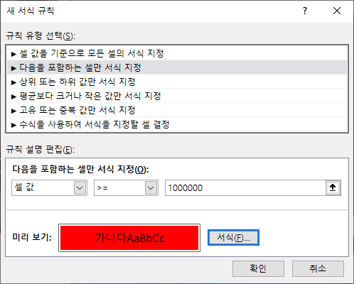

같은 셀 범위에 반복해서 여러 번 조건부 서식을 지정할 수 있습니다. [홈]-[스타일]-[조건부 서식]-[규칙 관리]를 선택하면 현재 선택 영역에 지정된 조건부 서식 목록을 확인할 수 있습니다. 규칙을 새로 만들거나 수정하거나 삭제할 수 있고, 규칙이 적용되는 순서를 조절합니다.

[규칙 지우기] 항목에서 선택 영역에 적용된 조건부 서식을 모두 지우거나 시트 전체에 적용된 조건부 서식을 한꺼번에 지울 수 있습니다.

# Ⅳ. 피벗 테이블
피벗 테이블은 많은 양의 데이터를 효율적으로 분석하고 요약하는 기능을 제공합니다. 데이터 기능인 정렬, 필터, 부분합, 중복된 항목 제거, 계산등을 피벗 테이블에 구현하고 있습니다. 데이터베이스 프로그램에서는 크로스탭이란 이름으로 쓰이고 있습니다.

## 1. 피벗 테이블 사용하기
따로 범위 선택할 필요없이 데이터베이스 범위에 포함되는 셀에 커서를 두고 [삽입]-[피벗 테이블]을 선택합니다. [피벗 테이블 만들기] 대화상자에서 범위가 자동으로 선택된 상태로 나타납니다. 혹시 범위가 자동으로 잡히지 않는 경우는 자료가 데이터베이스 형식이 아니기 때문인데, 직접 범위를 선택해서 만들 수도 있습니다. 데이터베이스 형식의 기본틀은 범위 선택된 첫 행에 필드명이 있고 그 다음 행부터 내용이 저장되어 있는 형식입니다.

피벗 테이블을 나타낼 위치는 새 워크시트와 기존 워크시트 중 선택할 수 있는데, 완성된 피벗 테이블을 원하는 위치에 복사, 이동할 수 있으므로 어느 곳에 만들던 큰 차이는 없습니다. 보통 [새 워크시트]에 만듭니다.

새 시트가 삽입되고 썰렁한 모습이 나타납니다. 왼쪽이 피벗 테이블이고 오른쪽은 피벗 테이블을 구성하는 도구입니다. 위쪽 필드 목록에서 아래쪽 영역으로 옮겨 피벗 테이블을 만듭니다.

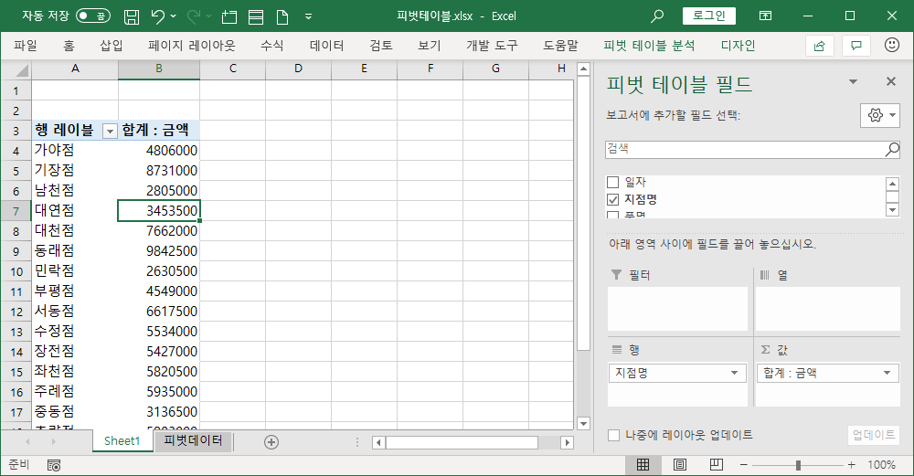

필드 목록에서 필드명 앞에 체크하면 자동으로 아래쪽 영역에 추가됩니다. 필드의 데이터 형식에 따라 삽입될 영역이 결정되는데, 문자나 날짜 형식인 경우에는 [행]에 삽입되고, 숫자 형식인 경우에는 [값]에 삽입됩니다.

필드를 추가할 때 체크하는 방법 외에도 직접 마우스로 드래그해서 원하는 영역에 놓을 수 있습니다.

[행] 영역에 삽입된 필드는 오름차순 정렬되고, [값] 영역에 삽입된 필드는 계산이 가능한 형식이면 합계를 구하고, 계산이 불가능한 경우에는 개수를 구해 값을 나타냅니다.

영역에 추가된 필드를 제거하려면 필드 목록에서 체크를 해제하거나 영역에서 필드를 드래그해서 필드 목록 바깥에 놓아 없앨 수 있습니다.

[값] 영역에 추가된 필드 표시 옆 역삼각형을 누르면 선택할 수 있는 메뉴가 표시되고 [값 필드 설정]을 선택해서 요약에 사용할 함수를 선택할 수 있습니다. 또 아래 [표시 형식] 항목에서 표시 형식을 정합니다.

[행]이나 [열] 영역에 추가된 필드는 그룹으로 묶을 수 있습니다. 숫자나 날짜 형식인 경우에는 각 형식에 맞는 그룹 방법을 제시하는 메뉴가 표시되고 문자 형식인 경우는 직접 묶을 범위를 선택한 다음 그룹 항목을 선택해 실행합니다.

그룹을 지정하면 오른쪽 피벗 테이블 필드 목록 창에 원래 데이터에는 없던 필드가 추가되는데, 그룹으로 묶인 항목을 필드로 다루기 위해 가상의 필드명을 붙인 것입니다. 이렇게 만들어진 필드명을 모두 지우려면 [피벗 테이블 분석]-[동작]-[지우기]-[모두 지우기]로 피벗 테이블을 초기화 합니다.

원본 데이터가 수정된 경우나 원본 데이터에 포함되어 있던 데이터가 삭제되는 경우 피벗 테이블에 바로 변경 내용이 적용되지 않습니다. 적용하려면 [피벗 테이블 분석]-[데이터]-[새로 고침]을 선택해 실행합니다. 데이터가 추가된 경우에는 [피벗 테이블 분석]-[데이터]-[원본 데이터 변경]을 선택해 데이터 범위를 다시 설정합니다.

## 2. 보고서 형식으로 디자인 설정
피벗 테이블을 보고서로 출력하거나 제출하려면 디자인을 보기좋게 수정해야 합니다. [디자인]-[레이아웃] 그룹에 있는 기능을 이용합니다.

[보고서 레이아웃] 항목에 세가지 형식이 있습니다. 압축, 개요, 테이블 형식인데, 따로 설정하지 않았으면 압축 형식이 기본적으로 지정되어 있습니다.

보고서 형식에서 많이 사용하는 테이블 형식을 선택합니다. 바로 아래 [모든 항목 레이블 반복]과 [항목 레이블 반복 안 함]이 있는데, 기관에 따라 선호하는 형태가 다르기 때문에 한 번씩 선택해서 어떤 모양인지 확인해 보고 선택합니다. 여기서는 [모든 항목 레이블 반복]을 선택합니다.

[행] 영역에 첫 번째 등록된 항목 기준으로 부분합이 표시되고 있는데, [부분합]-[부분합 표시 안 함]을 선택합니다. 총합계도 역시 [행 및 열의 총합계 해제]를 선택합니다.

[피벗 테이블 스타일 옵션]에서 [행 머리글] 체크는 해제합니다.

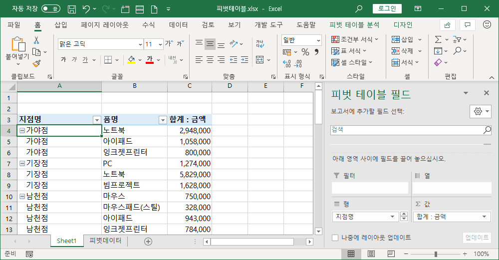

[값] 영역에 삽입된 필드 값 중 계산된 결과가 없는 경우 빈 셀로 나타나는데, 숫자 0으로 나타내고 싶다면 [피벗 테이블 분석]-[피벗 테이블]-[옵션]을 선택하고 [레이아웃 및 서식] 탭 [서식] 항목에서 [빈 셀 표시] 옆에 숫자 0을 입력합니다.

# Ⅴ. 수식과 함수
셀에서 수식을 작성하면 계산한 결과를 나타냅니다. 수식을 입력할 때 이퀄(=)을 먼저 넣고 시작해야 수식으로 인식합니다. 수식이 들어 있는 셀은 계산된 결과가 셀에 표시되고 수식 입력줄에 계산식이 표시됩니다. 단축키 &lt;Ctrl + \`(백쿼터)&gt;를 누르면 셀에 수식이 그대로 나타납니다. 작성된 수식을 확인하거나 오류가 생길 때 문제를 해결하려할 때 사용하는 방법입니다. 원래대로 셀에 수식 결과가 표시되도록 하려면 단축키 &lt;Ctrl + \`(백쿼터)&gt;를 다시 누릅니다.

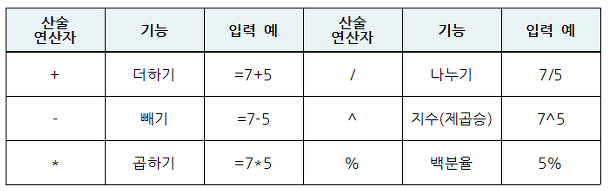

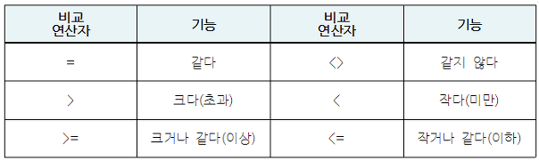

## 1. 참조 방식
수식을 작성할 때 계산할 숫자를 직접 사용하는 것이 아니라 값이 들어 있는 셀 주소를 사용해 수식을 작성합니다. 이렇게 셀 주소를 넣어 수식을 작성하는 것을 셀 참조라고 합니다.

직접 숫자를 입력해 두면 수식을 다른 셀로 복사하거나 채우기할 때 값도 수정해야 수식이 제대로 동작하는 문제가 있습니다. 또는 하나의 값을 여러 셀 수식에 사용할 때 값이 바뀌면 그 값을 사용한 여러 셀 수식을 수정해야 하는 문제가 발생합니다. 셀 참조가 이런 문제를 해결하는 방법이고, 엑셀이 계산 작업에 유용한 도구라고 알려지는데 큰 영향을 주었습니다.

한 셀에 수식을 작성한 다음 같은 형식의 셀에 수식을 복사 또는 채우기 하면 참조한 셀이 수식에 있는 경우 셀 주소가 바뀝니다. 복사해서 붙여넣기 된 셀 위치, 채우기된 셀 위치에 따라 저절로 바뀝니다. [C4] 셀을 참조한 경우 행 방향으로 1행 아래 셀에 수식을 복사했다면 행 방향으로 1 증가한 [C5] 셀로 수식 안의 셀 주소가 바뀝니다.

이렇게 수식을 복사하거나 채우기 할 때 참조한 셀 주소가 움직인 거리에 비례해서 바뀌는 셀 참조 방식을 상대 참조라고 합니다. 어떤 경우에는 수식을 복사하거나 채우기 해도 참조한 셀 주소가 바뀌지 않아야 될 때가 있습니다. 이럴 때 셀 참조 방식은 절대 참조라고 합니다. 절대 참조로 셀 참조를 하려면 셀 주소의 행과 열에 각각 달러($) 기호를 붙여 적습니다. [C4] 셀을 절대 참조하는 경우엔 [$C$4]로 셀 주소를 적으면 됩니다. 수식을 작성할 때 셀 참조는 직접 적는 것이 아니고 해당 셀을 선택하면 자동으로 셀 주소가 수식에 나타나듯이, 절대 참조로 셀 참조 주소를 바꿔야 하는 경우 직접 적지 않고 < F4 &gt;를 누르면 저절로 셀 참조 주소에 달러 기호가 붙습니다.

다른 셀 참조 방식으로 혼합 참조가 있습니다. 하나의 셀 주소를 나타낼 때 상대 참조와 절대 참조가 섞여 있는 방식입니다. 그래서 혼합 참조는 두가지 형태가 있습니다. 행 방향은 절대 참조, 열 방향은 상대 참조 방식인 [C$4] 셀 주소 형식과 행 방향은 상대 참조, 열 방향은 절대 참조 방식인 [$C4] 셀 주소 형식입니다.

상대 참조 셀 주소 상태에서 &lt;F4&gt;를 한 번 누르면 절대 참조 셀 주소로 바뀌고, 다시 &lt;F4&gt;를 누르면 혼합 참조 중 행은 절대 참조, 열은 상대 참조 셀 주소 상태로 바뀌고, 다시 &lt;F4&gt;를 누르면 혼합 참조 중 행은 상대 참조, 열은 절대 참조 셀 주소 상태로 바뀝니다. 다시 &lt;F4&gt;를 누르면 처음 상태인 상대 참조 셀 주소 상태가 됩니다.

셀 참조 방식 중 상대 참조는 기본 방식이기 때문에 그냥 사용하면 되고, 복사나 채우기를 할 때 절대 참조 방식을 선택해야 하는 경우가 언제인지 알아야 수식을 제대로 사용할 수 있습니다. 절대 참조 방식을 모르고는 수식을 이해할 수 없고, 특히 함수 사용법을 익히려면 꼭 알아야 하는 개념입니다.

혼합 참조 방식은 꼭 알아야 하는 것은 아니지만 참조 방식을 이해하게 되면 저절로 알게 되고 혼합 참조 방식을 이용하면 수식을 반복해서 만들어야 하는 일을 줄일 수 있습니다.

## 2. 자동 합계
자주 사용되는 수식을 쉽게 사용할 수 있도록 함수가 만들어졌습니다. 마치 수학 공식처럼 값만 대입하면 결과가 나오는 형식입니다.

여러 환경, 업무에서 사용되는 여러 수식을 함수로 만들어 약 330개 이상의 함수를 제공하고 있습니다. 새 버전을 발표할 때 새로운 함수가 추가되기도 합니다.

이런 함수 중 가장 많이 사용하는 함수 다섯가지를 모아 리본 메뉴에서 제공하는 것이 [자동 합계]입니다.

[자동 합계]는 [홈]-[편집]이나 [수식]-[함수 라이브러리]에 있습니다.

합계(SUM), 평균(AVERAGE), 숫자 개수(COUNT), 최대값(MAX), 최소값(MIN) 함수가 있습니다.

[자동 합계]를 사용할 때는 계산할 범위를 먼저 범위 선택한 뒤 자동 합계를 바로 누르거나 사용할 함수를 선택해 실행합니다.

[함수 삽입] 기능은 함수를 사용할 때 도움을 주는 기능입니다. 함수를 사용할 셀에 커서를 두고 이퀄(=)을 먼저 입력하고 사용할 함수 이름 앞 두, 세 글자를 입력하면 함수 목록이 나타납니다. 목록 중 사용할 함수를 더블클릭하면 함수 이름과 여는 괄호가 나타납니다. 이때 수식 입력줄의 [함수 삽입] 아이콘을 선택하거나 단축키 &lt;Shift + F3&gt;을 누르면 [함수 인수] 대화상자가 나타납니다.

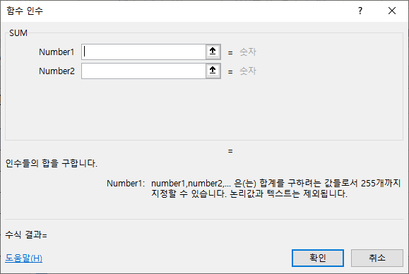

[함수 인수] 대화상자에서는 선택한 함수 사용법과 각 인수의 의미, 인수에 입력할 데이터 형식을 알려주고, 인수에 값을 입력하면 수식 결과도 미리 보여줍니다. 그리고 인수 중 문자로 입력해야할 때 큰따옴표를 넣지 않은 경우에는 대부분 자동으로 인식해 넣어 줍니다.

함수를 중첩해 복잡한 수식을 작성하는 경우 한 번에 한 함수만 보며 작성할 수 있는 방법을 제공합니다. 함수를 사용하는 것이 익숙하지 않을 때 도움을 주는 기능입니다.

## 3. 기본적인 함수
### 가. RANK 함수
RANK 함수는 순위를 구하는 함수입니다. 인수는 3개인데, Number 인수는 순위를 구할 숫자, Ref 인수는 순위를 구하려는 숫자가 포함된 셀 참조 범위, Order 인수는 순위를 구하는 방법, 즉 오름차순인지 내림차순인지를 결정하는 숫자를 적습니다. 내림차순이면 0이나 생략하고 오름차순인 경우엔 1을 입력합니다. 점수가 높은 사람이 1순위라면 내림차순이고, 점수 낮은 사람을 1순위로 하려면 오름차순으로 합니다.

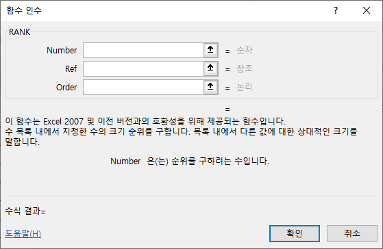

RANK 함수는 함수 목록에서 보면 다른 함수와 달리 노란색 느낌표가 붙어 있습니다. RANK 함수를 대체하는 함수가 엑셀 2010 버전부터 나왔습니다.

RANK.EQ 함수와 RANK.AVG 함수입니다. 같은 순위를 어떻게 처리할 것인가의 차이로 두 함수는 다릅니다. RANK.EQ 함수는 RANK 함수와 갔습니다. 2순위가 2개 있으면 둘 다 2순위로 표시되고 다음 순위는 4가 됩니다.

RANK.AVG 함수는 2순위가 2개 있으면 둘 다 2.5순위로 표시되고 다음 순위는 4가 됩니다. 같은 순위의 값이 있으면 평균순위를 구해 줍니다.

### 나. COUNTA 함수
COUNTA 함수는 COUNT 함수와 같이 개수를 구합니다. 차이점은 COUNT 함수가 개수를 구하는 셀이 숫자 형식의 데이터가 들어 있는 셀을 대상으로 하는 반면 COUNTA 함수는 문자, 숫자, 날짜/시간 형식의 데이터가 들어 있는 모든 셀을 대상으로 개수를 구한다는 차이입니다.

반대로 빈 셀만 개수를 구하는 COUNTBLANK 함수도 있습니다.

### 다. ROUND 함수
ROUND 함수는 반올림 함수입니다. Number 인수는 반올림을 적용할 숫자이고, Num_digits 인수는 반올림 한 뒤 몇 번째 자리까지 나타낼지 정하는 숫자입니다. 소수 세 번째 자리에서 반올림을 해서 소수 두 번째 자리까지 나타내려고 한다면 2를 입력하면 됩니다. 소수점을 기준으로 소수점 이하 자리는 양수로 입력하고, 소수점 이상 자리는 음수로 나타냅니다. 반올림해서 백원 단위로 나타내려고 하면 –2를 입력합니다.

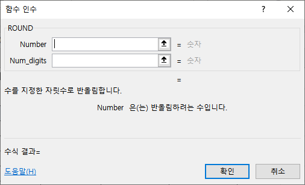

ROUND 함수와 같은 형식의 함수로 ROUNDUP 함수와 ROUNDDOWN 함수가 있습니다. ROUNDUP 함수는 올림하는 함수이고, ROUNDDOWN 함수는 버림하는 함수입니다.

### 라. IF 함수
IF 함수는 논리식의 결과가 참인 경우와 거짓인 경우를 판별하여 각각에 맞는 결과가 나오도록 만들어진 함수입니다.

Logical_test 인수는 참, 거짓으로 판별할 수 있는 논리식을 입력해야 하고, Value_if_true 인수와 Value_if_false 인수는 첫 번째 인수의 결과가 참인 경우와 거짓인 경우에 나타낼 문자, 숫자, 날짜/시간, 수식등 무엇이든 입력할 수 있습니다.

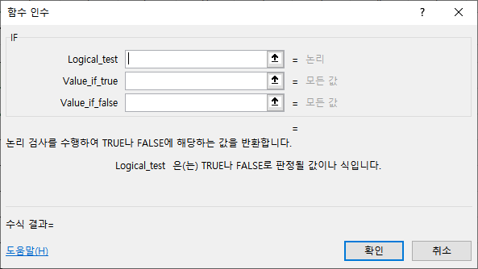

IF 함수 첫 번째 인수인 Logical_test 인수에는 조건을 하나만 지정할 수 있기 때문에 여러 가지 조건을 비교해야 하는 경우에는 논리식을 여러 개 입력할 수 있는 함수를 중첩해서 사용해야 합니다. 중첩할 함수로 OR 함수와 AND 함수를 사용하는데, OR 함수는 여러 개의 논리식 중 어느 것 하나라도 참이면 참을 결과값으로 출력하고, AND 함수는 여러 개의 논리식 모두 참이면 참을 결과값으로 출력합니다.

조건이 여러 가지가 아니라 한가지 값에 결과가 여러 가지인 경우, 예를들어 평균점수가 90 이상이면 “A”, 80 이상이면 “B”, 70 이상이면 “C”, 나머지는 “D”로 나타내야 하는 경우에는 IF 함수에 처음 조건인 90 이상인지 확인하는 논리식을 작성하고, 참인 경우엔 “A”를 나타내고, 거짓인 경우에 다시 IF 함수를 넣어 두 번째 조건인 80 이상인지 확인하는 논리식을 작성하고, 거짓인 경우는 다시 IF 함수를 넣는 식으로 수식을 작성합니다.

이렇게 IF 함수 안에 또 다시 IF 함수를 넣는 방식을 중첩 IF 함수라고 합니다. IF 함수를 여러 번 중첩하지 않더라도 함수 안에 다른 함수를 쓰는 경우를 함수 중첩 또는 중첩 함수라고 합니다.

### 마. COUNTIF 함수
COUNTIF 함수는 조건에 따른 개수를 구하는 함수입니다. IF 함수와 COUNT 함수가 결합된 형태입니다.

Range 인수는 조건과 일치하는지 비교할 값들이 있는 셀 범위를 입력하고, Criteria 인수는 조건으로 비교할 값을 입력합니다. 문자나 숫자 또는 비교식을 입력합니다. 비교식을 적을 때 IF 함수의 논리식과 달리 Range 인수에 비교할 셀 주소가 있기 때문에 비교하는 부분만 입력합니다. 예를들어 나이가 20 이상인 경우 조건식은 “&gt;=20”을 입력합니다.

함수식을 작성한 뒤 채우기를 한다면 Range 인수는 절대 참조를 해야 합니다.

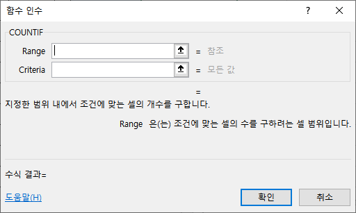

비슷한 함수로 SUMIF, AVERAGEIF, COUNTIFS, SUMIFS, AVERAGEIFS, MAXIFS, MINIFS 함수가 있습니다. MAXIFS 함수와 MINIFS 함수는 엑셀 2019 버전 이상에서 사용할 수 있습니다.

### 바. VLOOKUP 함수
VLOOKUP 함수는 찾기 대상이 되는 표에서 특정 값을 찾아 관련 값을 가져오는 함수입니다. 찾기 대상이 되는 표는 행 방향으로 값을 나열해야 합니다.

Lookup_value 인수는 찾을 값을 입력합니다. 문자나 숫자, 날짜등 모든 값이 입력 가능합니다. Table_array 인수는 찾기 대상이 되는 표의 셀 주소를 입력합니다. Col_index_num 인수는 찾기 대상이 되는 표에서 결과로 출력할 값이 들어있는 열의 순서 번호를 입력합니다. Range_lookup 인수는 찾는 방법을 적는데, 정확하게 찾으려면 FALSE를, 비슷하게 일치하는 것을 찾을 때는 TRUE를 적거나 생략합니다. TRUE/FALSE보다는 주로 0 또는 1 숫자를 적습니다. 비슷하게 찾는다는 의미는 숫자인 경우 모든 숫자를 나열할 수 없기 때문에 범위를 지정해서 찾을 때 사용됩니다.

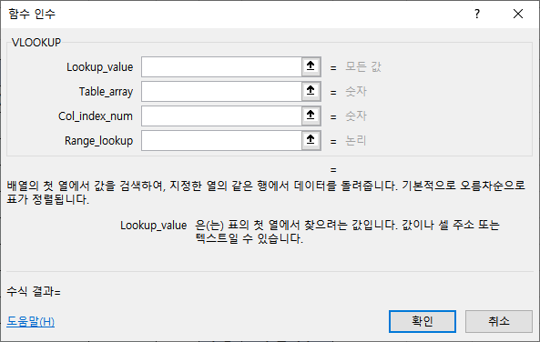

함수식을 작성해서 채우기 하는 경우에는 두 번째 인수인 Table_array 인수는 절대 참조해야 합니다.